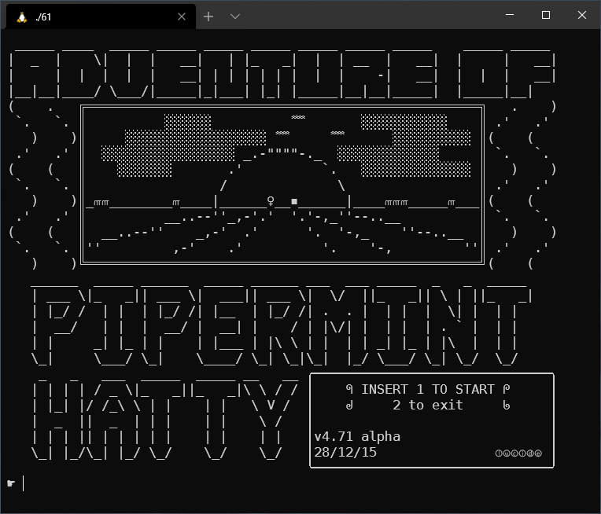
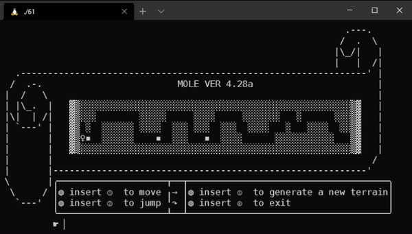

# The Adventure of Pipermint Hatty

  

## What's this?

A tiny sidescrolling text-graphics game written in C. It's a project I made when I was 15.

At the time we had just began learning programming, this was made just after we learnt about **arrays** (no 2D arrays yet :) ).

2D arrays, weren't a thing yet, so I used three separated arrays to create a 3 cells high world. The main feature was procedural level generation: stages had to be random but playable.

At the time I knew no alternatives besides `scanf("%d")` to process input. If text is entered, the game breaks.

## Features

* completely written in [Geany](https://www.geany.org/) on a Ubuntu VM
* screen cleared with `system("clear")`, *ouch*!
* procedural terrain generation
* oldest project recovered (missing: *roulette*)

  

## Curator

* UNIX project
* CMake scripts have been added
