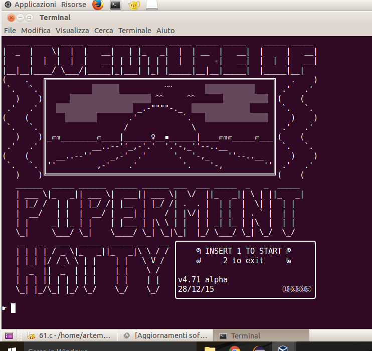

# The Adventure of Pipermint Hatty
This is a tiny sidescrolling ascii game I wrote in C when I was 15.
At the time I was at the 3rd year of highschool, and we had just began learning programming, using C. This was made just after I was taught about arrays.